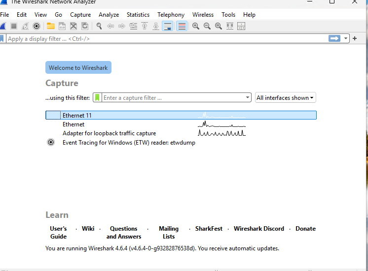
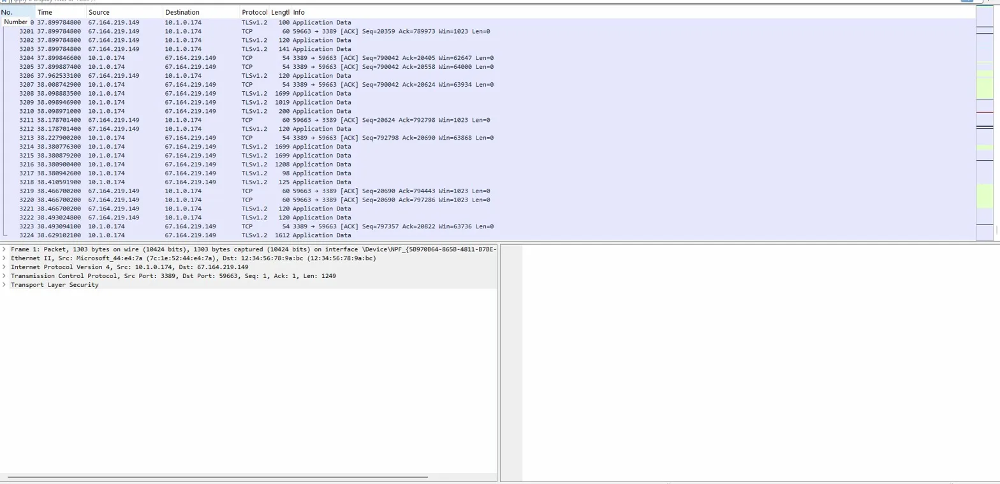
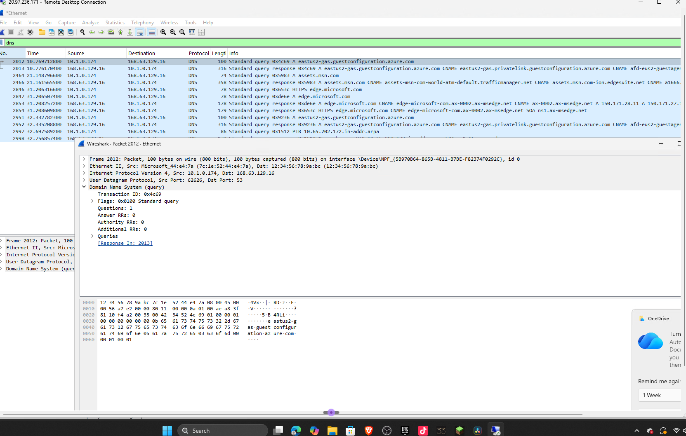
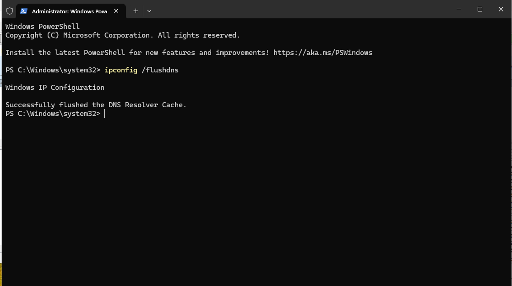
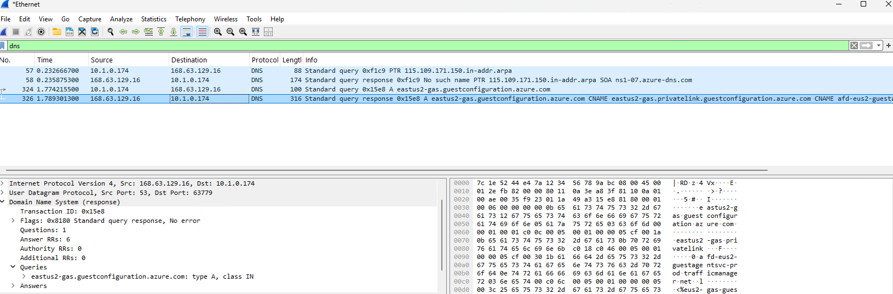
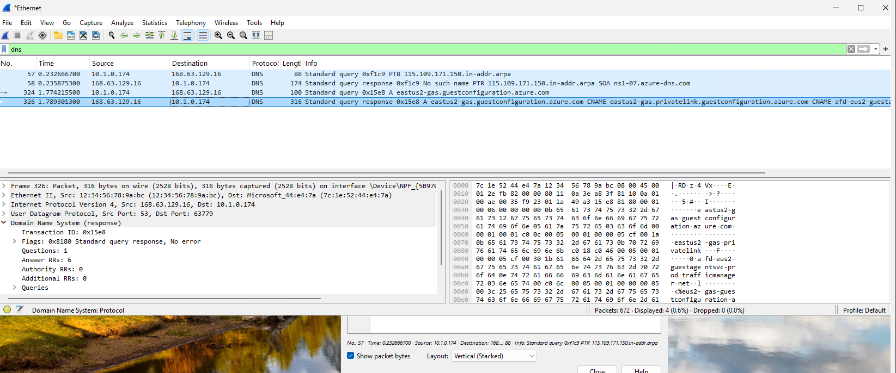
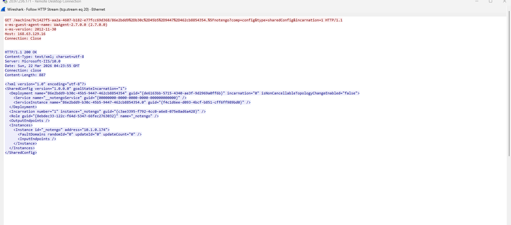
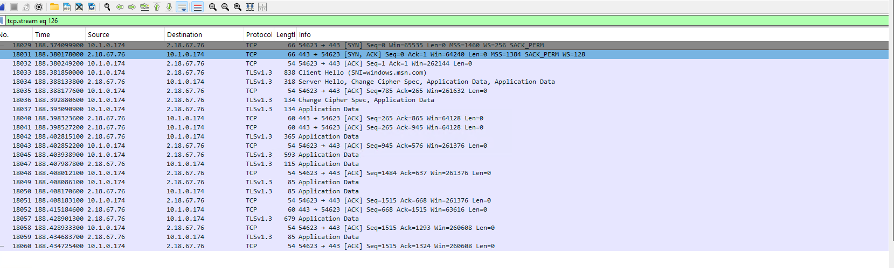
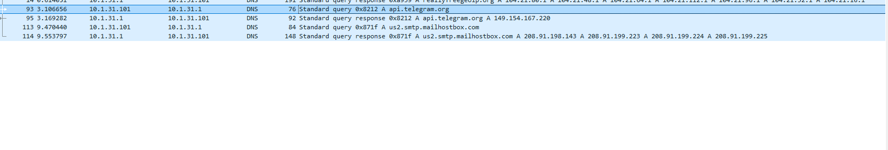

# Wireshark Network Traffic Analysis — Agent Tesla Credential Exfiltration

## Objective

Deploy and operate Wireshark on a cloud-hosted Windows VM to analyze both live network traffic and a malicious PCAP file. Demonstrate proficiency in packet capture, protocol filtering, traffic baselining, IOC extraction, and MITRE ATT&CK mapping through hands-on analysis of a real-world Agent Tesla infostealer infection.

---

## Environment

| Component | Details |
|---|---|
| Platform | Microsoft Azure |
| VM OS | Windows 11 |
| Tool | Wireshark 4.6.4 |
| Malicious PCAP | 2025-01-31 VIP Recovery Data Exfil over SMTP |
| PCAP Source | malware-traffic-analysis.net |

---

## Tools Used

- Wireshark 4.6.4
- Npcap (packet capture driver)
- Windows PowerShell (`ipconfig /flushdns`)
- nslookup (IP/domain resolution)
- base64decode.org (credential decoding)

---

## Lab Overview

This lab is structured in two parts. Part 1 covers live traffic capture and analysis on an Azure Windows VM, establishing a baseline of normal network behavior. Part 2 covers forensic analysis of a malicious PCAP containing a confirmed Agent Tesla credential stealer infection, resulting in a full set of IOCs for use in Lab 2 (Incident Response).

---

## Part 1 — Live Traffic Capture and Baselining

### Interface Selection and Capture

Wireshark was installed on the Azure VM and the active Ethernet interface was identified by locating the interface with a live activity graph. A 60-second capture was initiated to observe ambient traffic.

**Screenshot: Wireshark interface selection**

**Screenshot: Live packet capture — RDP and TLS traffic**

Initial capture revealed two dominant IPs: the VM's internal address `10.1.0.174` communicating with `67.164.219.149` over TLSv1.2 on port 3389 — the active RDP session used to connect to the VM.

---

### DNS Filter Analysis

The `dns` filter was applied to isolate DNS query traffic. Initial results showed only Azure infrastructure queries between `10.1.0.174` and `168.63.129.16` (Azure's internal DNS resolver) with no domain names visible in the query section.

**Screenshot: DNS filter — no domain names visible initially**

**Troubleshooting:** Domain names were absent because the VM had previously resolved those domains and cached the results. Windows cached DNS entries do not generate new queries, so Wireshark had nothing to capture.

**Resolution:** The DNS resolver cache was flushed using `ipconfig /flushdns` in PowerShell, then new sites were visited to generate fresh queries.

**Screenshot: DNS cache flush confirmation**

**Screenshot: DNS queries with domain names visible after cache flush**

**Key observation:** `168.63.129.16` is a reserved Microsoft Azure IP used as the internal DNS resolver for all Azure VMs. Traffic to this IP is expected background noise and not an indicator of compromise.

---

### HTTP Filter and Stream Analysis

The `http` filter was applied and a GET request from the Azure VM guest agent was identified. Using Follow > TCP Stream, the full unencrypted HTTP conversation was reconstructed revealing the Azure guest agent calling home to `168.63.129.16` to retrieve VM configuration data in XML format.

**Screenshot: HTTP GET request**

**Screenshot: HTTP stream — Azure guest agent XML payload**

**Key observation:** Unencrypted HTTP traffic exposes full request and response content including headers, parameters, and response bodies. This technique — Follow > TCP Stream — is the same method used in Part 2 to extract credentials from the malicious PCAP.

---

### TCP Filter and IP Isolation

The filter `tcp.flags.syn == 1` was applied to identify TCP connection handshakes. Browser traffic was generated to `github.com` to produce external connections. Using `nslookup` to resolve the destination IP and `ip.addr ==` filtering, traffic to Akamai CDN (`2.18.67.76`) was isolated, revealing TLS on port 443 — expected HTTPS traffic.

**Screenshot: TCP traffic analysis — SYN, SYN-ACK, ACK sequence and TLS**

**Key observation:** GitHub routes traffic through Akamai's CDN rather than resolving directly to the IP returned by nslookup. This is a real-world example of why IP-based filtering requires CDN awareness — the nslookup result alone was insufficient.

---

### Normal Traffic Baseline Summary

| Indicator | Normal Value | Notes |
|---|---|---|
| DNS resolver | `168.63.129.16` | Azure internal resolver — expected |
| RDP traffic | `67.164.219.149` port 3389 TLSv1.2 | Active RDP session |
| HTTP | `168.63.129.16` port 80 | Azure guest agent check-ins |
| HTTPS | External IPs port 443 TLSv1.3 | Browser traffic via CDN |
| Ephemeral ports | 49152–65535 as source | Normal OS-assigned return ports |

---

## Part 2 — Malicious PCAP Analysis (Agent Tesla)

### PCAP Overview

| Field | Value |
|---|---|
| File | 2025-01-31-VIP-Recovery-data-exfil-over-SMTP.pcap |
| Total packets | 426 |
| Protocols observed | DNS, TCP, HTTP, TLS, SMTP |
| Malware family | Agent Tesla / VIP Recovery credential stealer |

---

### Step 1 — Identify the Infected Host

`Statistics > Conversations > IPv4` was used to identify the top-talking IPs in the capture.

`10.1.31.101` appeared in every conversation, communicating with multiple external IPs — confirming it as the infected host. The most active external connection was `208.91.198.143` with 210 packets and 114KB transferred.

---

### Step 2 — Trace the Exfiltration Channel

Filtering by `ip.addr == 208.91.198.143` revealed a high volume of SMTP traffic on port 587. An AUTH login packet was identified with a Base64-encoded username: `ZGlyZWN0b3JAaWdha3Vpbi5jb20=`

Decoded: `director@igakuin.com`

This confirmed the malware was authenticating to an SMTP mail server to exfiltrate stolen data via email.

---

### Step 3 — Extract Stolen Credentials via TCP Stream

Follow > TCP Stream on an SMTP packet revealed the full credential dump. The email body was encoded in Quoted-Printable format (`=0D=0A` = line break). After decoding, the email contained:

**Email metadata:**
- From: `director@igakuin.com`
- To: `director@igakuin.com` (attacker sending to own inbox)
- Subject: `Pc Name: david.miller | / VIP Recovery \`
- Victim hostname: `DESKTOP-WE9H2FM`
- Victim public IP: `34.205.4.78` (Ashburn, Virginia, US)

**Credentials stolen from browser saved passwords:**

| Source | Platform | Username | Password |
|---|---|---|---|
| Google Chrome | Amazon | david.miller@millershomebrew.com | P@ssw0rd1! |
| Edge Chromium | LinkedIn | david.miller@millershomebrew.com | P@ssw0rd! |
| Edge Chromium | Facebook | 3841584372 | P@ssw0rd! |

**Attacker OPSEC failure:** The malware did not use TLS to encrypt the SMTP session, exposing the full credential dump in plaintext. This allowed complete visibility into the exfiltrated data.

---

### Step 4 — Identify Secondary C2 Channel

Applying the `dns` filter to the malicious PCAP revealed a DNS query for `api.telegram.org` resolving to `149.154.167.220`. Telegram is a known platform used by threat actors for C2 communication and data exfiltration due to its legitimate appearance in network traffic and low likelihood of being blocked by enterprise firewalls.

**Screenshot: Telegram C2 DNS query**

---

### Step 5 — Characterize Exfiltration Pattern

SMTP connections to `208.91.198.143` were clustered within a short timeframe rather than spread at regular intervals. This pattern is consistent with a single-event credential exfiltration — the malware executed, harvested all available browser-saved passwords, sent them in one burst, and terminated. This differs from persistent beaconing implants which communicate on a regular timer.

---

## IOC Summary

| Type | Value | Context |
|---|---|---|
| Infected host IP | `10.1.31.101` | Internal IP of compromised machine |
| Infected hostname | `DESKTOP-WE9H2FM` | Victim machine name |
| Victim user | `david.miller` | Credential dump subject |
| Victim public IP | `34.205.4.78` | Ashburn, Virginia |
| Exfiltration IP | `208.91.198.143` | SMTP mail server — primary exfil destination |
| Exfiltration port | 587 | SMTP submission — unencrypted |
| Attacker inbox | `director@igakuin.com` | Receives stolen credentials |
| C2 domain | `api.telegram.org` | Secondary C2 channel |
| C2 IP | `149.154.167.220` | Telegram API server |
| Malware | Agent Tesla / VIP Recovery | Browser credential stealer |

---

## MITRE ATT&CK Mapping

| Technique ID | Name | Observed Behavior |
|---|---|---|
| T1555.003 | Credentials from Web Browsers | Passwords harvested from Chrome and Edge saved password stores |
| T1048.003 | Exfiltration Over Unencrypted Non-C2 Protocol | Credentials exfiltrated over unencrypted SMTP port 587 |
| T1071.001 | Application Layer Protocol: Web Protocols | Telegram API used as secondary C2 channel |
| T1027 | Obfuscated Files or Information | Base64 encoding used for SMTP AUTH credentials |

---

## Challenges and Observations

**DNS cache issue:** Initial DNS filter showed no domain names in query packets. Root cause identified as Windows DNS caching — previously resolved domains do not generate new queries. Resolved by running `ipconfig /flushdns` and visiting new sites. This is relevant to SOC work: cached DNS means an infected host may communicate directly to a malicious IP without generating a DNS query, requiring cross-reference with connection logs.

**CDN routing:** GitHub traffic did not appear when filtering by the IP returned from `nslookup github.com`. The browser connected to Akamai CDN infrastructure instead. This demonstrates why IP-based IOC matching requires CDN awareness and threat intelligence context.

**Quoted-Printable encoding:** The credential dump email body used Quoted-Printable encoding (`=0D=0A` for line breaks, `=` for line continuation). Recognizing and mentally decoding this encoding was necessary to read the stolen credentials in the TCP stream.

**Attacker OPSEC failure:** The malware operator did not configure TLS for the SMTP exfiltration channel, exposing the full credential dump to any network observer. This is a common mistake in commodity malware and a key reason why network monitoring catches infostealers that endpoint tools miss.

---

## Skills Demonstrated

`Network Traffic Analysis` `Wireshark` `Packet Capture` `Protocol Filtering` `IOC Extraction` `Credential Exfiltration Detection` `SMTP Analysis` `DNS Analysis` `TCP Stream Reconstruction` `MITRE ATT&CK Mapping` `Threat Hunting` `Traffic Baselining` `Base64 Decoding` `Incident Triage`

---

## Lab Chain — Connection to Lab 2

The IOCs extracted in this lab feed directly into Lab 2 (Incident Response Simulation). The infected host (`10.1.31.101`), exfiltration destination (`208.91.198.143`), attacker inbox (`director@igakuin.com`), and Telegram C2 channel (`api.telegram.org`) will serve as the basis for the IR scenario, containment steps, and remediation recommendations in the next lab.
